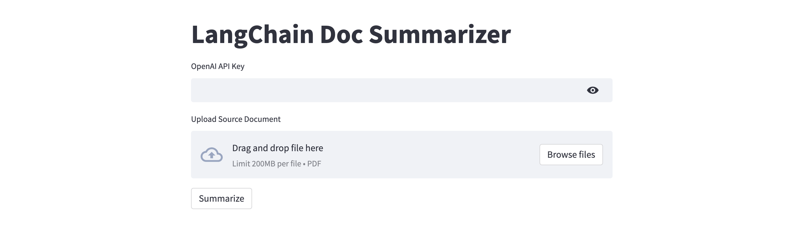

# langchain-chroma-summary
A sample Streamlit web application for summarizing documents using LangChain and Chroma.

[LangChain](https://langchain.readthedocs.io/en/latest) is an open-source framework created to aid the development of applications leveraging the power of large language models (LLMs). It can be used for chatbots, text summarisation, data generation, code understanding, question answering, evaluation, and more. [Chroma](https://www.trychroma.com), on the other hand, is an open-source, lightweight embedding (or vector) database that can be used to store embeddings locally. Together, developers can easily and quickly create AI-native applications.

For a detailed guide, see [this](https://alphasec.io/summarize-documents-with-langchain-and-chroma/) post. To deploy on [Railway](https://railway.app/?referralCode=alphasec) using a one-click template, click the button below.

To open the Python notebook in Google Colab, click the button below.

