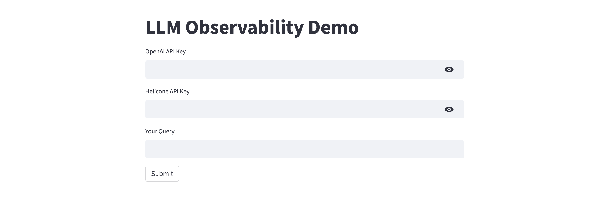

# langchain-helicone
A sample Streamlit web application to demo LLM observability using LangChain and Helicone.

[LangChain](https://langchain.readthedocs.io/en/latest) is an open-source framework created to aid the development of applications leveraging the power of large language models (LLMs). It can be used for chatbots, text summarisation, data generation, code understanding, question answering, evaluation, and more. [Helicone](https://www.helicone.ai), on the other hand, is an open-source tool for tracking costs, usage, and latency for LLM-powered applications. 

For a detailed tutorial on LLM observability challenges, and how to address them using Helicone, see [this](https://alphasec.io/open-source-llm-observability-with-helicone) post. 

To deploy on [Railway](https://railway.app/?referralCode=alphasec) using a one-click template, click the button below.

To open the Python notebook in Google Colab, click the button below.

