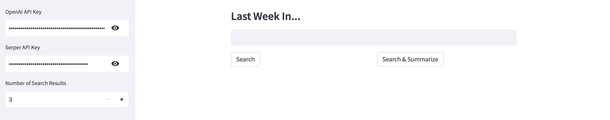
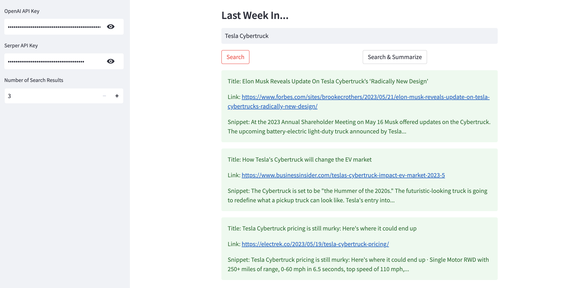
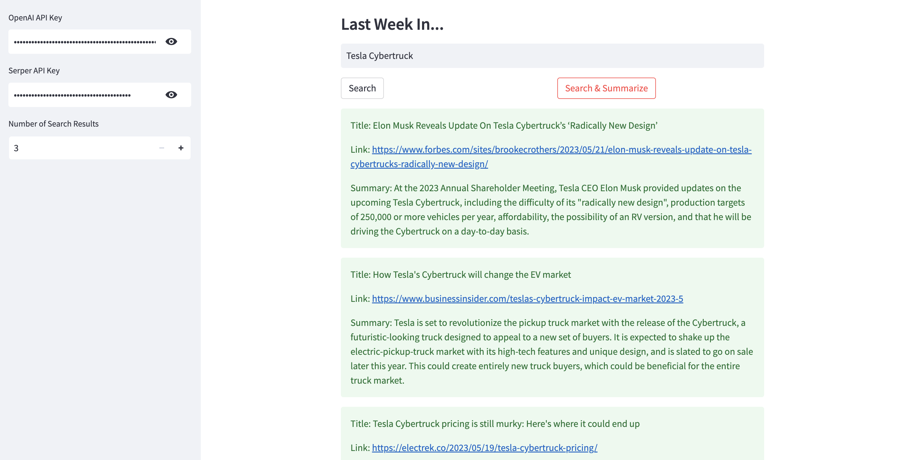

# langchain-news
A sample Streamlit application for Google news search and summaries using LangChain and Serper API.

[LangChain](https://langchain.readthedocs.io/en/latest) is an open-source framework created to aid the development of applications leveraging the power of large language models (LLMs). It can be used for chatbots, text summarisation, data generation, code understanding, question answering, evaluation, and more. [Serper](https://serper.dev/), on the other hand, allows you to submit queries and receive Google Search (SERP) results quickly and cost effectively.

You'll need API keys from OpenAI (get it [here](https://platform.openai.com/account/api-keys)) and Serper (get it [here](https://serper.dev/api-key)).

Here's a sample search result using Serper API only.

Here's a sample search result with AI-generated summaries using Serper and OpenAI APIs.

For a detailed guide, see [this](https://alphasec.io/summarize-google-news-results-with-langchain-and-serper-api) post. To deploy on [Railway](https://railway.app/?referralCode=alphasec) using a one-click template, click the button below.

