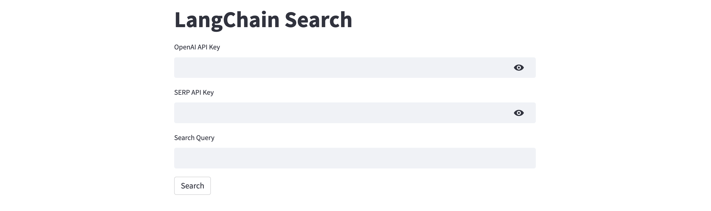

# langchain-search
A sample Streamlit web application for search queries using LangChain and SerpApi.

[LangChain](https://langchain.readthedocs.io/en/latest) is an open-source framework created to aid the development of applications leveraging the power of large language models (LLMs). It can be used for chatbots, text summarisation, data generation, code understanding, question answering, evaluation, and more. [SerpApi](https://serpapi.com/), on the other hand, is a tool for scraping search engine results pages (SERPs). It provides a simple and efficient way to gather data from popular search engines like Google, Bing, Yahoo, and more.

To deploy on [Railway](https://railway.app/?referralCode=alphasec) using a one-click template, click the button below.

To open the Python notebook in Google Colab, click the button below.

