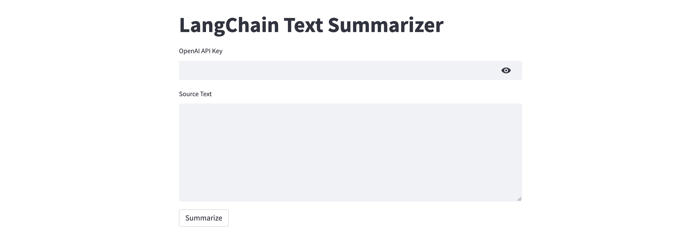

# langchain-text-summary
A sample Streamlit web application for summarizing text using LangChain and OpenAI.

[LangChain](https://langchain.readthedocs.io/en/latest) is an open-source framework created to aid the development of applications leveraging the power of large language models (LLMs). It can be used for chatbots, text summarisation, data generation, code understanding, question answering, evaluation, and more.

For a detailed guide, see [this](https://alphasec.io/summarize-text-with-langchain-and-openai/) post. To deploy on [Railway](https://railway.app/?referralCode=alphasec) using a one-click template, click the button below.

To open the Python notebook in Google Colab, click the button below.

