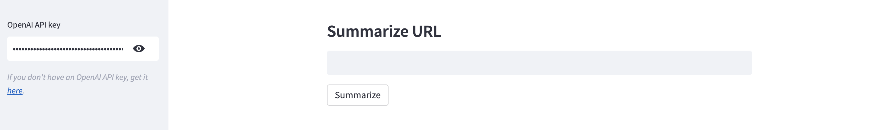
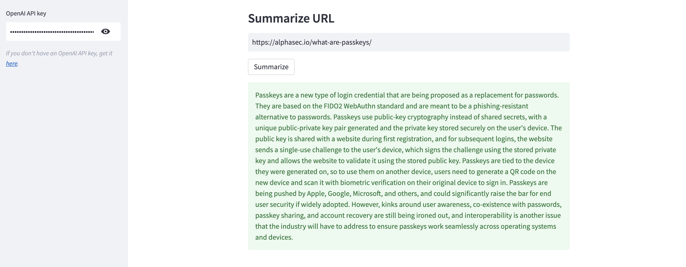

# langchain-url-summary
A sample Streamlit application to summarize URL content using LangChain and OpenAI.

[LangChain](https://langchain.readthedocs.io/en/latest) is an open-source framework created to aid the development of applications leveraging the power of large language models (LLMs). It can be used for chatbots, text summarisation, data generation, code understanding, question answering, evaluation, and more. This project uses the `UnstructuredURLLoader` class to load URL data, and the `load_summarize_chain` chain to generate a summary. Instead of the default model, it uses the `gpt-3.5-turbo` chat model for better results and cost-effectiveness. 

Here's a sample OpenAI-generated URL content summary. If you don't have an OpenAI API key, get it [here](https://platform.openai.com/account/api-keys).

